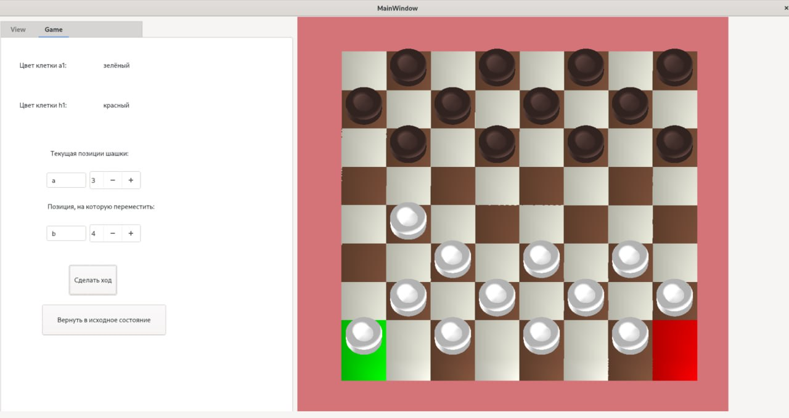
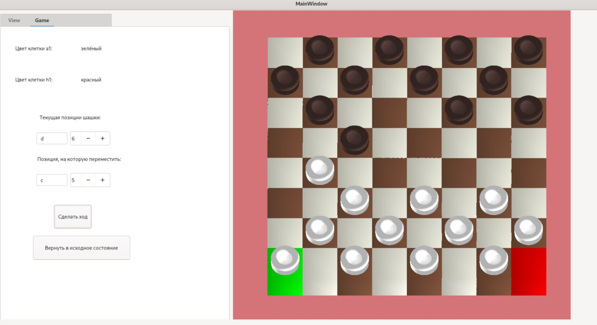
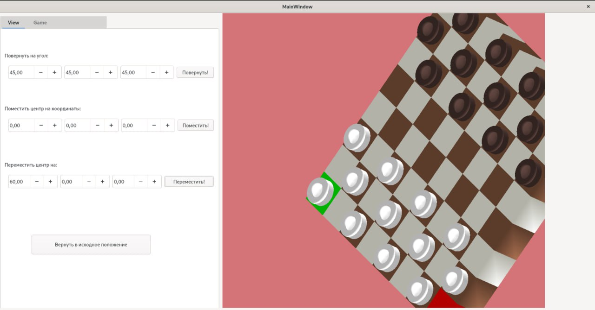
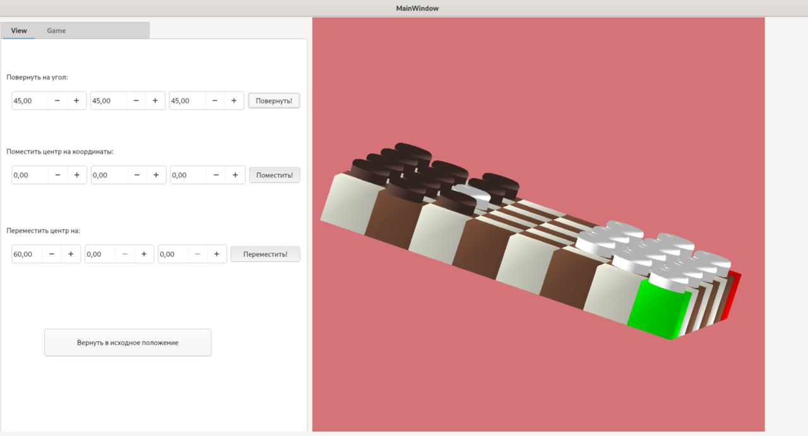

# Курсовая работа по компьютерной графике, 5 семестр

Разработать программное обеспечение симуляции игры в 3D шашки на  
64-клеточной доске. Разработать модель фигуры, образованную объединением цилиндра и тора. 
Разработать  интерфейс, который будет позволять переставлять шашки на доске, изменять
размер шашек и доски, задавать угол поворота доски относительно ее центра и возвращать
фигуры в начальное положение на доске. Шашки будут переставляться согласно правилам 
игры. Предусмотреть наличие источника света на бесконечности. 

## Примеры работы программы

